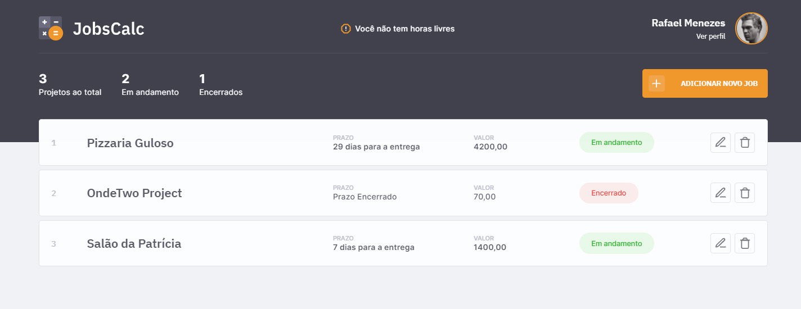
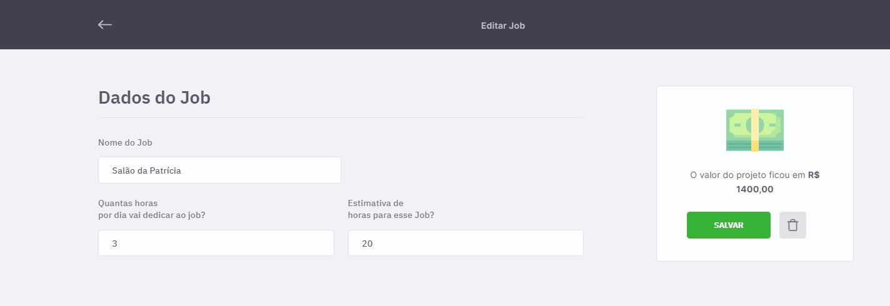
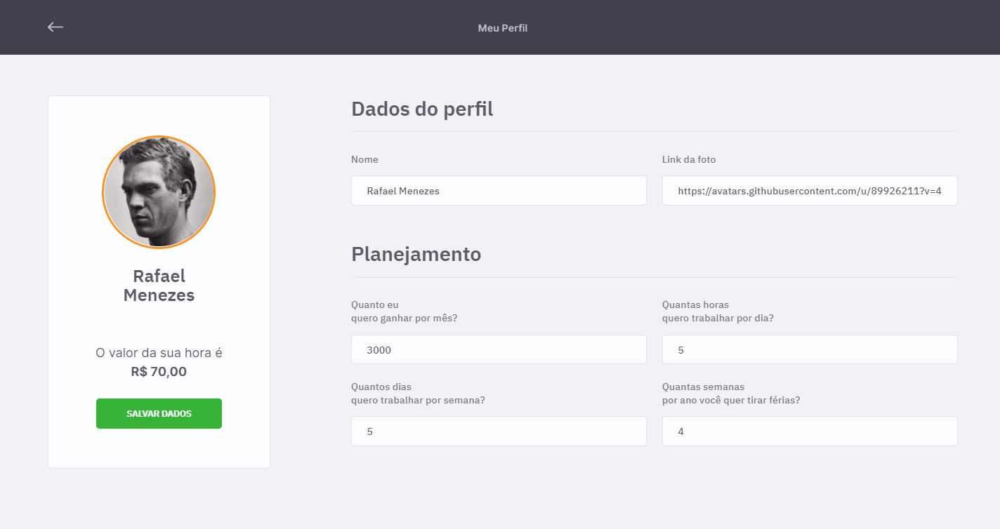

# jobs-calc
 **Exercício da Maratona Dicover - Edição 02 - Rocketseat**

## :memo: Objetivo: 
Construir um mini sistema financeiro com fluxo de caixa.

## :desktop_computer: Tecnologias Usadas:
* HTML5
* CSS3
* JavaScript
* EJS
* NodeJS
* Express
* SQLite

## :package: Como Instalar: 

Inicie o npm para que os modulos utilizados sejam baixados para o projeto.
``` 
$ npm init 
```

Crie o banco de dados e insira alguns dados demonstrativos
``` 
$ npm run init-bd
``` 

## :hammer: Como Utilizar:

Inicie o servidor para poder utilizar a aplicacão.
``` 
$ npm start
``` 

Agora a aplicação está funcionando pelo servidor local na porta 3000.

**Acesse pelo navegador:** [http://localhost:3000/](http://localhost:3000/)

## :camera: Screenshot:

 *Dashboard*

 *Ediação de Job*

 *Perfil*
